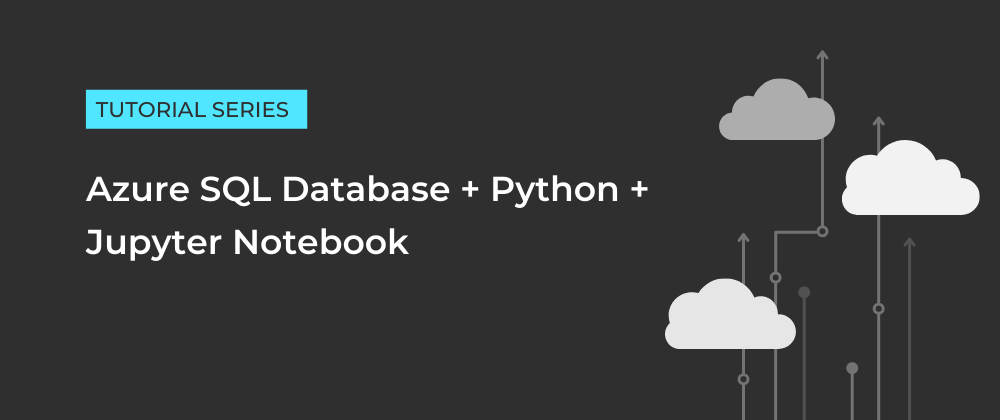

# Azure SQL Database and Python in Jupyter Notebooks
#### PART 1: Create an Azure SQL Database via the Azure portal

  

In this tutorial, you will learn how to create an Azure SQL Database and configure firewall rules to enable connectivity.

#### PART 2: Connect to Azure SQL Database using Python and Jupyter Notebook

  
  

In this tutorial, you will learn how to use Python and Jupyter Notebooks to connect to an Azure SQL Database.

#### PART 3: Insert Python dataframe into Azure SQL table

  
  
  

In this tutorial, you will learn how to use Python and Jupyter Notebooks to insert a dataframe into an Azure SQL table.

 
 

  <em>Originally published at <a href="https://www.foteinisavvidou.codes/" target="_blank">www.foteinisavvidou.codes</a></em>

