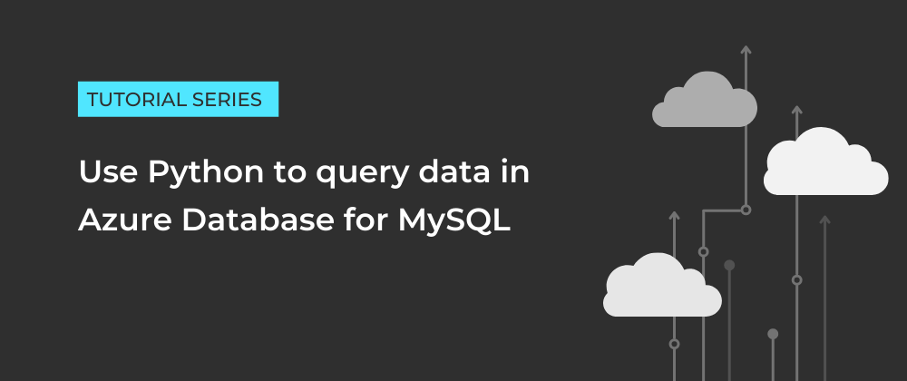

# Use Python to query data in Azure Database for MySQL
#### PART 1: Create an Azure Database for MySQL server via the Azure portal

  

In this tutorial, you will learn how to create an Azure Database for MySQL single server, create a new database and configure firewall rules.

#### PART 2: Connect to Azure Database for MySQL using Python

  
  

In this tutorial, you will learn how to connect to your Azure Database for MySQL using Python and Visual Studio Code.

#### PART 3: Use Python to manipulate data in Azure Database for MySQL

  
  

This tutorial will show you how to use Python to create tables and manipulate data in Azure Database for MySQL.

#### PART 4: Insert data from file in Azure Database for MySQL

  
  

In this tutorial, you will use SQL statements to manipulate data in Azure Database for MySQL and learn how to open files in Python.

 
 

  <em>Originally published at <a href="https://sfoteini.github.io/" target="_blank">sfoteini.github.io</a></em>

